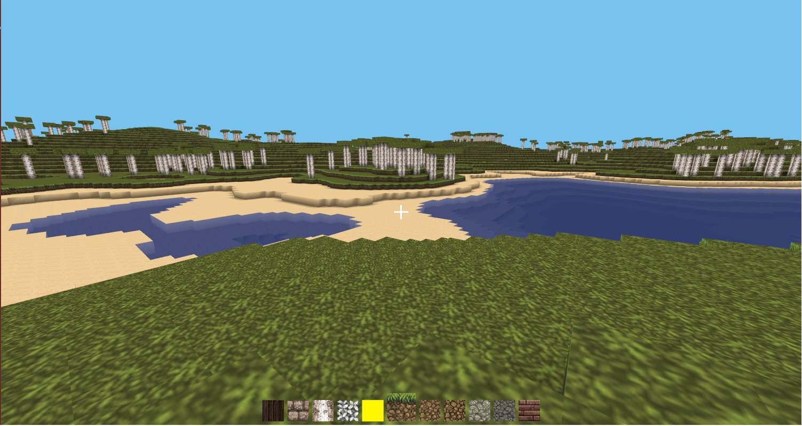

# Voxel Game

A project about creating a voxel based game.
The game currently uses the working title "Librecraft".



The Kanban board with features and progress can be found here:
[Taiga Kanban Board](https://tree.taiga.io/project/felixbarring-voxelgame/kanban)

## Background

The purpose of this project is to create a voxel based game, similar to
games such as Minecraft and Infiniminer. The most characteristic feature is the 
ability to modify the world by removing and adding cubes. The player can move
around in a seemingly infinite world, exploring and creating content. To
make this possible, components such as rendering, collision detection, and
procedural terrain generation must be implemented. Other components
that can be relevant are: artificial intelligence and multi-player.

[My Bachelor Thesis](https://gupea.ub.gu.se/handle/2077/39606) 
was about creating a voxel game engine in Java using OpengGL, together
with five other students. Although we were successful with reaching our goals,
there were several aspects of the implementation that I think could have been
done better. As I am interested in learning C++, I figured that doing a similar
project in C++ instead of Java would be a good way to learn the language and
various other topics, such as computer graphics and OpenGL.

### Goals
My main goal with this project will be to learn as much as possible, if the game
happens to be enjoyable that would of course be good, but it is not the main
concern. The primary focus will be on rendering and world interaction. When
those areas have been implemented other aspects such as Terrain Generation,
AI, Audio, and GUIs will hopefully be implemented.

## Building

Cmake, SFML, compilers etc needs to be installed.
Currently only tested on my Ubuntu machine and a Fedora.
Instructions for Windows will likely come sometime in the future.

Instructions on how to get going.

```
Installing dependencies on Ubuntu:
  sudo apt-get install cmake make g++ clang-5.0 libsfml-dev libglew-dev 

  Optional tools:
  cppcheck doxygen clang-format valgrind

  Should be something similar on Fedora

Buiding:
  git clone --recursive https://github.com/felixbarring/VoxelGame
  cd VoxelGame/scripts
  bash setupBuildRelease.sh
  bash build.sh
  bash runGame.sh

```

